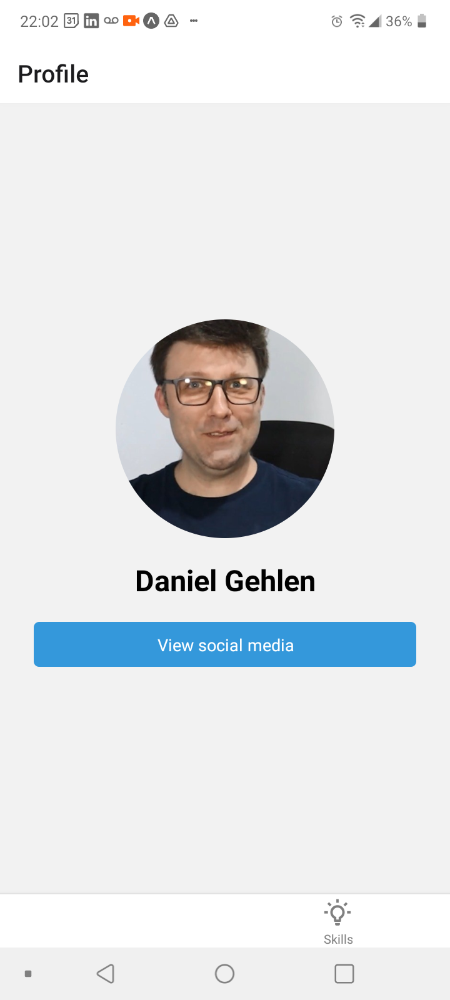
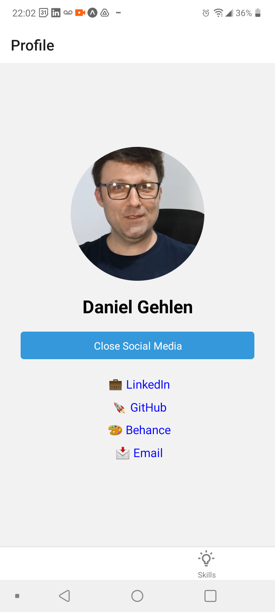
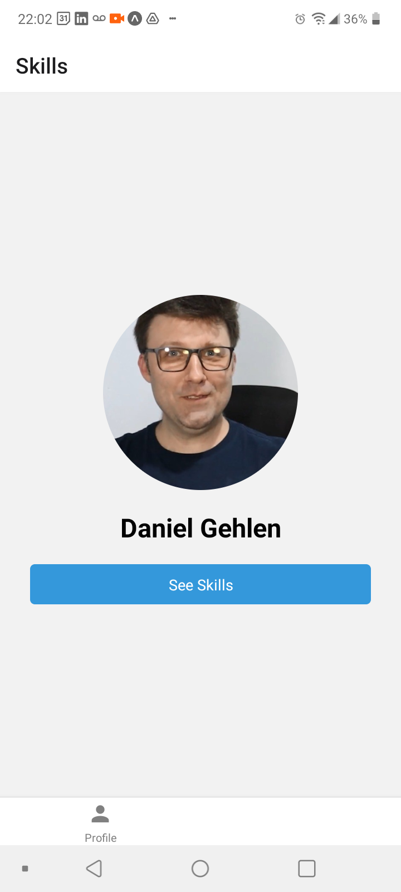
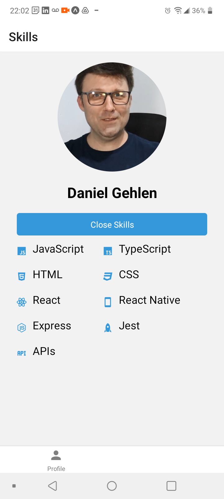

# Technical Report: React Native Portfolio Project

## Introduction

The development project of the portfolio using React Native was conceived to provide an effective and modern experience for users who want to view information about skills, projects, and professional contacts. This report details the methods, results, and conclusions achieved during development.

## Methods

### Technologies Used

The project was implemented using the following technologies:

- **React Native**: JavaScript framework for mobile development.
- **React Navigation**: Library for navigation management in React Native applications.
- **React Native Vector Icons**: Icon package for React Native.
- **FlatList**: Component for efficient rendering of lists.
- **TypeScript**: Programming language for static typing.

### Project Structure

The project structure was organized in a modular way, with the following main components:

1. **MainScreen.tsx**: The main screen displaying information about the author and links to social media.

2. **SkillScreen.tsx**: Screen presenting technical skills organized in an accordion, with related icons.

3. **Navigation**: Navigation configuration using React Navigation to switch between screens.

## Results

### Main Screen (MainScreen)

The main screen displays the author's photo, name, and links to social media profiles. Navigation is intuitive, allowing users to easily access additional information.

### Skills Screen (SkillScreen)

The skills screen features an accordion with icons representing technologies and their proficiency levels. The use of FlatList provides a smooth user experience, especially on mobile devices.

## Conclusion

The project achieved its goals by providing an efficient and attractive mobile application for displaying a professional portfolio. The use of React Native allowed the creation of a native interface, while TypeScript brought advantages of static typing, improving code robustness.

## Case Study: User Experience

To assess the user experience, tests were conducted with potential users, resulting in positive feedback. The intuitive interface and simplified navigation were highlighted as strengths. The accordion on the skills screen provided an organized and visually pleasing way to present technical information.

## Final Considerations

The React Native portfolio project is a practical example of the effectiveness of this technology for mobile application development. The use of good development practices, code organization, and attention to the user experience contributed to the success of the project.

This report provides a comprehensive view of the development process, highlighting methods, results, and conclusions. The case study complements the technical analysis, showing practical application and end-user acceptance.

**End of Report**
